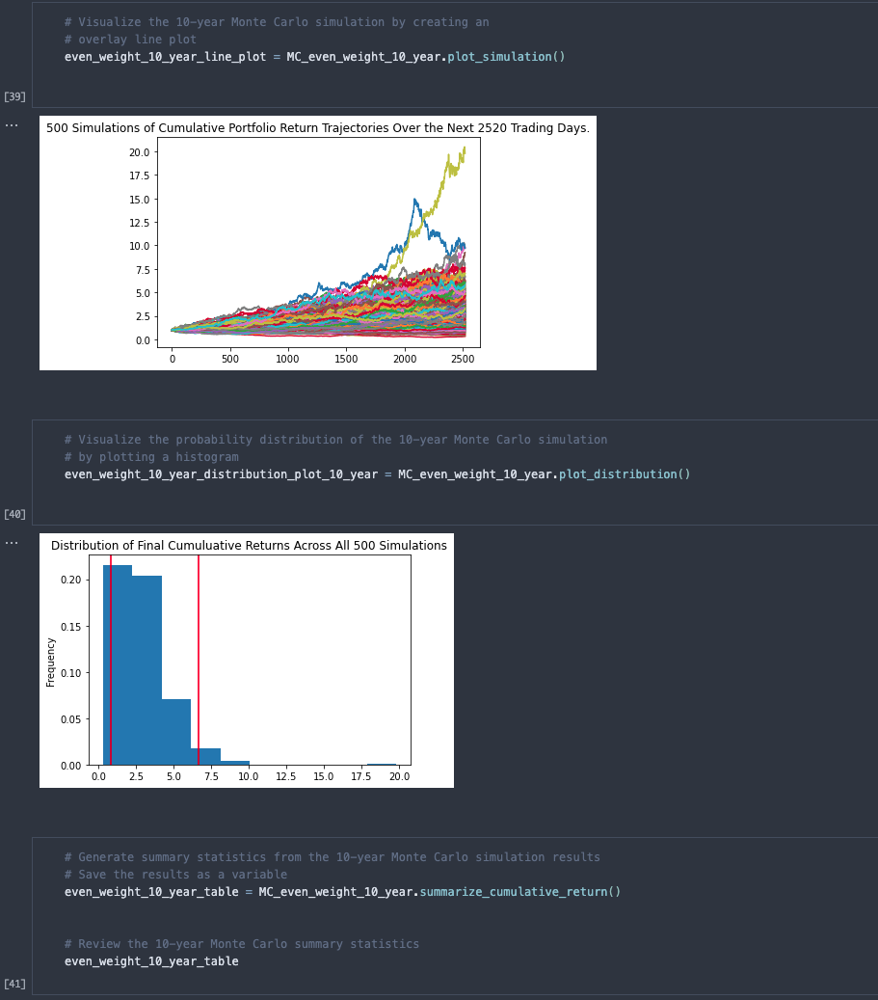

# Financial Planning Tool

This notebook is used to calculate possible portfolio returns on a sample portfolio composed of crypto and stock/bond assets. 

---

## Technologies

This project leverages Python 3.7 with the following packages:

* [Pandas](https://pandas.pydata.org/docs/) - Data analysis and manipulation tool

* [Path](https://docs.python.org/3/library/pathlib.html) - Offers classes representing filesystem paths with semantics appropriate for different operating systems

* [Alpaca Trade API](https://pypi.org/project/alpaca-trade-api/) - Python library for the Alpaca Commission Free Trading API

---

## Installation Guide

Before running the application, first install the following dependencies.

```python
  pip install pandas
  pip install pathlib
  pip install alpaca-trade-api
```

---

## Examples

Upon running the notebook, you will see several graphics assisting in your analysis



---

## Usage

To use the financial planning tools notebook, open financial_planning_tools.ipynb in a Jupyter Lab environemnt (or other IDE with Jupyter notebook extensions):

---

## Contributors

Pull requests are welcome. For major changes, please open an issue first to discuss what you would like to change.

Please make sure to update tests as appropriate.

---

## License

N/A
